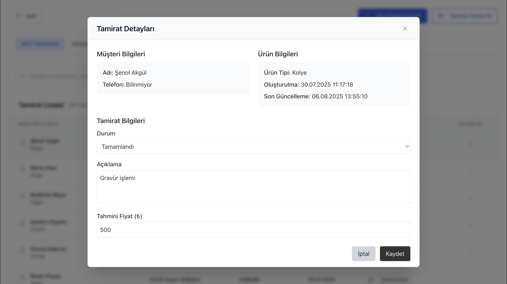
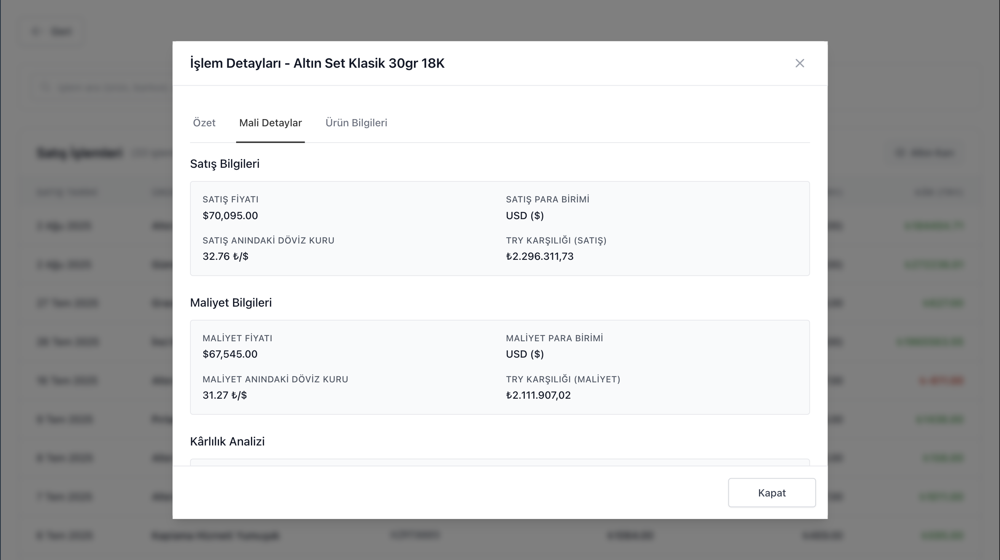
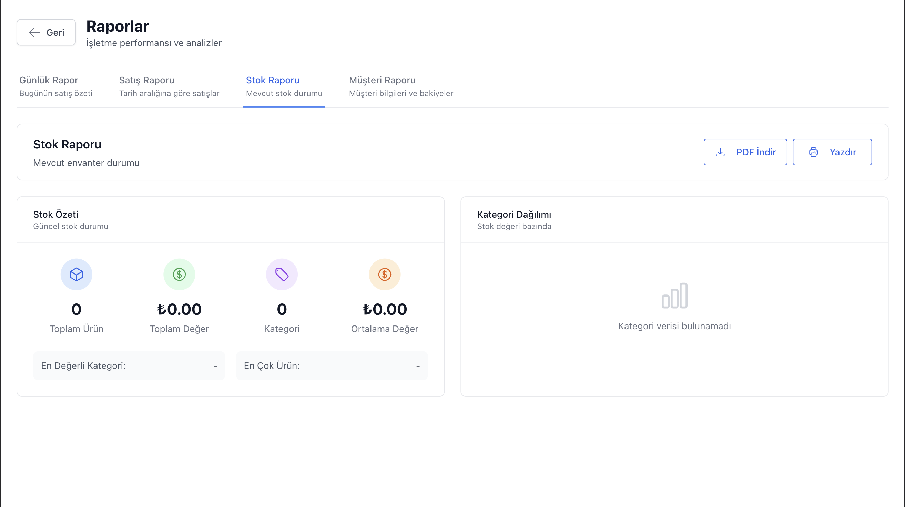

# SilverStream: Kuyumcu Envanter Yönetimi
**Modern Kuyumcular için Güvenilir, Çevrimdışı Envanter Çözümü.**

---

*SilverStream'in kullanıcı dostu ana paneli*

### Basit, Güçlü ve Her Zaman Erişilebilir.

Karışık e-tablolarla uğraşmaktan, benzersiz parçaların takibini kaybetmekten ve karmaşık ya da sürekli internet bağlantısı gerektiren yazılımlarla boğuşmaktan yoruldunuz mu? **SilverStream** tam size göre tasarlandı. Bir kuyumcu işletmesini yönetmenin zorluklarını anlıyoruz, bu yüzden **tamamen çevrimdışı** çalışan, şık ve kullanımı kolay bir masaüstü uygulaması geliştirdik. Envanterinizi yönetin, finansal takibinizi yapın ve müşterilerinize güvenle hizmet verin; tüm verilerinizin bilgisayarınızda güvende, emniyette ve her an erişilebilir olduğunu bilmenin rahatlığını yaşayın.

---

## ✨ Ana Özellikler

SilverStream, günlük operasyonlarınızı basitleştirmek ve size gönül rahatlığı sağlamak için tasarlanmış özelliklerle doludur.

### 💎 Benzersiz Envanterinize Hakim Olun
İster gramla gümüş, ister el yapımı tek parça yüzükler satın, esnek sistemimiz her ikisini de kolayca yönetir.
- **Hibrit Envanter Modeli:** Hem **ağırlığa göre ürünleri** (zincirler, ham maddeler gibi) hem de **adet bazlı ürünleri** tek bir sistemde sorunsuzca yönetin.
- **Özel Alanlar:** Her parçanın benzersiz özünü yakalamak için ayar, taş cinsi, usta adı gibi ihtiyacınız olan her türlü detayı ekleyin.
- **Net Organizasyon:** Kolay filtreleme, arama ve raporlama için ürünlerinizi kategorilere ayırın.

*Kapsamlı envanter listesi ve filtreleme seçenekleri*

*Kolay ürün ekleme formu - hibrit envanter modeli*

*Detaylı ürün bilgileri ve özel alanlar*

### ║█║▌║█║ Profesyonel Barkod Sistemi
Etiketleri elle yazmayı bırakın ve iş akışınızı modernleştirin. Doğrudan uygulama içinden profesyonel barkod etiketleri oluşturun, tasarlayın ve yazdırın.
- **Özel Etiket Tasarımcısı:** Sürükle-bırak arayüzü sayesinde markanıza uygun, bilgi dolu ve şık etiketler tasarlayın.
- **Anında Yazdırma:** Yeni ürünler için tek tek veya tüm koleksiyonunuz için yüzlerce etiketi toplu olarak yazdırın.
- **Standart Yazıcılarla Uyumlu:** Yaygın olarak kullanılan termal etiket yazıcıları ile uyumludur.

*Güçlü sürükle-bırak etiket tasarımcısı*

*Toplu barkod üretimi ve yazdırma özelliği*

### 💰 "Cari Hesap" ile Finansal Takip
Türkiye pazarının vazgeçilmezi olan **"Cari Hesap"** özelliği ile kimden alacağınız, kime borcunuz olduğunu kolayca takip edin.
- **Ayrı Finansal Defterler:** Tedarikçi borçlarınızı ve müşteri alacaklarınızı envanter maliyetlerinizden tamamen ayrı tutarak net ve doğru bir muhasebe sağlayın.
- **İşlem Geçmişi:** Ödemeleri kaydedin, yeni borçlar ekleyin ve her hesap için tam bir geçmişle düzeltmeler yapın.
- **Bir Bakışta Bakiyeler:** Her müşteri ve tedarikçinin finansal durumunu anında görün.

*Müşteri ve tedarikçi cari hesap takibi*

*Detaylı cari hesap geçmişi ve işlem takibi*

### 🔧 Tamirat Yönetimini Baştan Sona Kontrol Edin
Profesyonel bir tamirat hizmeti sunun ve her işi kolaylıkla takip edin.
- **Tamirat Kaydı:** Yeni tamirat işlerini hızla kaydedin, müşteri bilgilerini alın ve fiyat tahmini sunun.
- **Durum Takibi:** "Beklemede" durumundan "Teslim Edildi" durumuna kadar her işin ilerlemesini takip edin.
- **Sorunsuz Teslimat:** Nihai ödemeleri alın ve işleri teslim edildi olarak işaretleyin; bu işlem, kayıtlarınız için otomatik olarak bir satış işlemi oluşturur.

*Yeni tamirat işi kayıt formu*

*Aktif tamirat işleri ve durum takibi*

*Tamirat teslim alma ekranı*

### 🚫 Tamamen Çevrimdışı Çalışır
İnternetiniz kesildiğinde işiniz durmaz. SilverStream, tamamen bilgisayarınızda çalışan yerel bir masaüstü uygulamasıdır.
- **Her Zaman Erişilebilir:** İnternet bağlantısı olsun ya da olmasın, tüm verilerinize erişin, satış yapın ve etiket yazdırın.
- **Hızlı ve Akıcı:** Web sayfalarının yüklenmesini beklemeden, takılma olmadan hızlı bir deneyimin keyfini çıkarın.
- **Verileriniz Size Ait:** İşletme bilgileriniz bir bulut sunucusunda değil, güvenli bir şekilde kendi bilgisayarınızda saklanır.

### 🛡️ Güvenli Veri Yedekleme ve Geri Yükleme
Verileriniz, işletmenizin can damarıdır. Onu güvende tutmayı basitleştiriyoruz.
- **Tek Tıkla Yedekleme:** Tüm uygulama verilerinizi (envanter, işlemler, müşteri bilgileri) tek tıkla USB bellek veya harici disk gibi güvenli bir yere kolayca yedekleyin.
- **İç Huzuru:** Bilgisayar arızası veya yeni bir cihaza geçiş durumunda verilerinizi aynı kolaylıkla geri yükleyin.

### 📊 Basit Raporlama
Karmaşık e-tablolarda kaybolmadan işletmenizin performansını anlayın.
- **Satış ve Kâr Özeti:** İstediğiniz tarih aralığı için toplam satışlarınızı, maliyetlerinizi ve net kârınızı net bir şekilde görün.
- **Tamirat Geliri:** Tamirat hizmetlerinizin ne kadar gelir getirdiğini tam olarak bilin.
- **Satılan Ürünler Listesi:** Belirli bir dönemde satılan tüm ürünleri hızla gözden geçirin.

*Kapsamlı satış ve kâr raporları*

*Detaylı işlem görüntüleme ve düzenleme*

*Tedarikçi kayıtları ve stok takibi*

*Kapsamlı ayarlar ve konfigürasyon seçenekleri*

---

## 📸 Ekran Görüntüleri Galerisi

SilverStream'in tüm özelliklerini daha yakından görmek için aşağıdaki ekran görüntülerini inceleyin:

### 📦 Envanter Yönetimi Detayları

*Ürün ekleme sihirbazı - sınıflandırma adımı*

*Ürün ekleme sihirbazı - fiyatlandırma adımı*

*Doldurulmuş fiyatlandırma formu*

*Tedarikçi bilgileri ve stok detayları*

*Tedarikçi borç notları ve kayıtları*

*Ürün ekleme önizleme ve onay*

*Toplu ürün ekleme konfigürasyonu*

*Toplu fiyat güncelleme modalı*

### 🏷️ Barkod ve Etiket Yönetimi

*Toplu barkod oluşturma ve yazdırma*

*Çoklu barkod yazdırma önizlemesi*

### 🔧 Tamirat Yönetimi Detayları

*Aktif tamirat işleri listesi*

*Müşteri bazında tamirat geçmişi*

*Tamirat detayları modalı*

*Müşteri detay sayfası*

*Yeni tamirat sihirbazı - müşteri seçimi*

*Yeni tamirat sihirbazı - detay girişi*

*Tamirat teslimi - müşteri arama*

### 💰 İşlem ve Finansal Yönetim

*Satış işlemleri listesi*

*Altın kârı hesaplamalı satış işlemleri*

*Satış öğesi detay modalı - genel görünüm*

*Satış öğesi detay modalı - fiyatlandırma*

*Satış öğesi detay modalı - ürün bilgileri*

*Hızlı satış sihirbazı - detaylar*

*Birleşik satış sihirbazı - ürün seçimi*

*Müşteri cari hesapları listesi*

*Yeni müşteri hesabı oluşturma modalı*

*Müşteri işlem geçmişi detayları*

### 🏪 Tedarikçi Yönetimi

*Tedarikçiler listesi ve yönetimi*

*Yeni tedarikçi ekleme modalı*

*Tedarikçi bilgilerini düzenleme modalı*

### 📊 Raporlama ve Analiz

*Gün sonu raporu genel görünümü*

*Gün sonu nakit dökümü detayları*

*Günlük satış ve kâr özeti*

*Detaylı satış analizi raporu*

*Stok durumu ve envanter raporu*

*Müşteri bakiyeleri ve borç durumu*

---

## 🎯 Kimler İçin Uygun?

SilverStream, aşağıdakiler için mükemmel bir çözümdür:
-   **Bağımsız Kuyumcular ve Altın Ustaları**
-   **Küçük Perakende Mağazaları ve Butikler**
-   **Benzersiz parçalar satan Zanaatkarlar ve El Sanatçıları**
-   **Basit, güvenilir ve çevrimdışı** bir envanter ve satış çözümüne ihtiyaç duyan her işletme.

---

## 🚀 Uygulamayı Edinin

Başlamak çok kolay. Karmaşık kurulum veya komut satırlarına gerek yok.

1.  **[En Son Sürüm Sayfası](https://github.com/avocatt/Jewelry-inventory-management-offline-conversed/releases/latest)** adresine gidin.
2.  **Assets** bölümünden işletim sisteminize uygun dosyayı indirin:
    *   **Windows için**: `.exe` ile biten dosyayı indirin.
    *   **macOS için**: `.dmg` ile biten dosyayı indirin.
3.  **İndirilen dosyaya çift tıklayın** ve kurulum talimatlarını izleyin. Hepsi bu kadar!

---

## 📜 Lisans & Destek

#### Lisans
Bu, ticari bir yazılımdır. Kullanımı, uygulama ile birlikte gelen Son Kullanıcı Lisans Sözleşmesi (EULA) tarafından yönetilmektedir.
 
*Copyright © 2024 Emre Terzi. Tüm hakları saklıdır.*